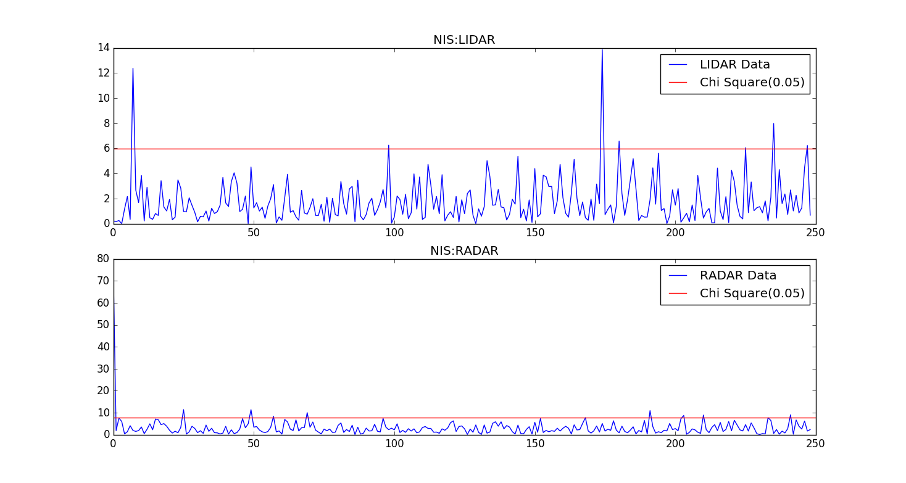
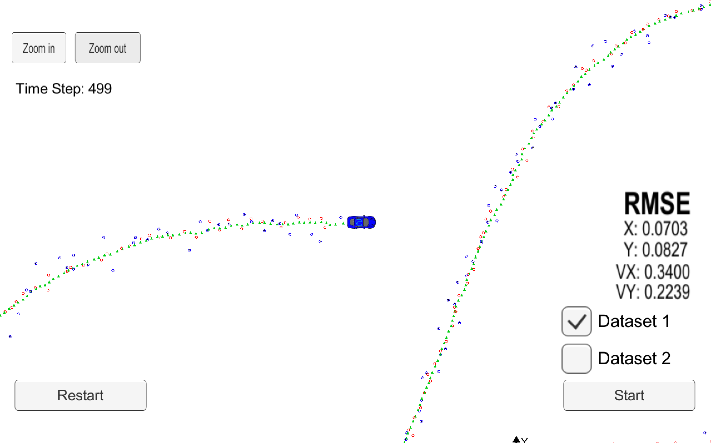

# Unscented Kalman Filters
---

The presented project combines the data collected by LASER and RADAR sensors to locate obstacles encountered by a car while driving through a pathway.

This project is part of Udacity's Self Driving Car Engineer Nanodegree and needs the simulator provided by Udacity to execute the project.

## Content
---

Some of the important files and folders are listed below:

**/src**
- The src folder consists of the following important .cpp files:
    - ukf.cpp
        - implementation of Unscented Kalman Filters which fuses the measurements obtained from LIDAR and RADAR sensors
    - tools.cpp
        - implementation of Root Mean Square Error function to calculate the accuracy between ground truth and the value predicted by Unscented Kalman Filters
    - main.cpp
        - main procedure implementation
    - /Eigen
        - package consisting of implementation of Matrix and Vector based arithmetic operations

**/NIS**
- The NIS folder consists of **plot_nis.py** Python file which is used to plot the Normalized Innovation Squared (NIS) value which is used to tune the process noise parameters
- The folder also contains the NIS values for LIDAR and RADAR sensor with filenames **NIS_laser.csv** and **NIS_radar.csv** respectively.

**/Debug**
- This folder consists of executable file **UnscentedKF.sh** which runs the main procedure of the project.

**/data**
- Consists of the file **obj_pose-laser-radar-synthetic-input.txt** which stores the sensor measurements of LIDAR & RADAR

**CMakeLists.txt**
- Cmake file to build the project

**UnscentedKF.xcodeproj**
- Xcode IDE project file used to build the project files

## Usage
---

1. Run the **UnscentedKF.sh** executable file to run the program.
2. Run the Udacity's Simulator and select 'Project 1/2: EKF/UKF'.
3. Select Dataset 1 and click on 'Start' to start the simulator.
4. The RMSE for the experiment will be displayed on the screen.
5. In **ukf.cpp** set the variables `use_laser_` and `use_radar_` as True or False according to your experiment to use either LIDAR or RADAR or both the sensors.

## Observations
---

**Part A: Tuning the Process Noise**
- We have chosen our process noise paramaters namely longitudinal acceleration standard deviation (std_a) as **1.5** and yaw acceleration standard deviation (std_yawdd) as **0.3926** or (π/8).
- The values have been chosen randomly and are based on the lectures related to project mentioned in the Udacity's Self Driving Car Nanodegree Program.
- The NIS graphs for these values are as follows:

**Part B**
- Now let us plot down the RMSE values using the LIDAR and RADAR sensors.

|Case  |Px    |Py    |Vx    |Vy    |
|------|------|------|------|------|
|LASER |0.1726|0.1500|0.6258|0.2588|
|RADAR |0.2138|0.2658|0.3944|0.3083|
|BOTH  |0.0703|0.0827|0.3400|0.2239|

- While LASER data provides better position the RADAR data provides better understanding of velocity and as displayed by the RMSE data in the table **Fusion of sensors provides the best RMSE value**.

## Conclusion
---

- From the above observations we can see that the results obtained from UKF are far more better than EKF ( For EKF values please refer the README of [Extended Kalman Filters Project](https://github.com/anborde/Extended-Kalman-Filters) on GitHub.
- Also, the UKF algorithm is much more efficient than the EKF algorithm as the estimation of Sigma Points is less complex compared to the highly computational Jacobian Matrix which is used in EKF.
- Both, EKF and UKF have dominantly proved that a single sensor is not adequate to judge the position and velocity of an obstacle and **Sensor Fusion** is an important aspect of **Self Driving Cars**.
